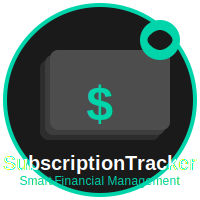

# 📱 Subcriot Tracker

<div align="center">
  
  <br>
  <em>Subscription Expense Tracker for Financial Management</em>
</div>

A powerful iOS app that helps you track subscriptions, optimize spending, and get AI-powered financial insights to save money and manage your recurring expenses effectively.

## ✨ Features

### 📊 **Smart Dashboard**
- **Financial Health Score**: AI-powered assessment of your subscription health
- **Monthly Spending Overview**: Clear visualization of your subscription costs
- **Upcoming Renewals**: Never miss a billing date with smart notifications
- **Category Breakdown**: Visual charts showing spending by category
- **Quick Actions**: Easy access to common tasks

### 🤖 **AI Financial Advisor**
- **Smart Insights**: AI analysis of your subscription patterns
- **Personalized Recommendations**: Suggestions to optimize your spending
- **Cost-Benefit Analysis**: Calculate ROI for each subscription
- **Usage Analytics**: Track actual usage vs. cost
- **Financial Health Monitoring**: Continuous assessment of your subscription health

### 💳 **Subscription Management**
- **Easy Addition**: Add subscriptions with detailed information
- **Smart Categorization**: Automatic categorization of services
- **Payment Tracking**: Track all payment methods and cycles
- **Renewal Alerts**: Smart notifications before renewals
- **Usage Tracking**: Monitor how much you actually use each service

### 🔒 **Security & Privacy**
- **Local Data Storage**: All data stored securely on your device
- **Face ID/Touch ID**: Secure authentication
- **No Cloud Sync**: Your financial data stays private
- **Encrypted Storage**: Core Data with encryption

## 🏗️ Architecture

This app follows **MVVM (Model-View-ViewModel)** architecture with:

- **SwiftUI**: Modern, declarative UI framework
- **Core Data**: Local data persistence with encryption
- **Combine**: Reactive programming for data flow
- **Core ML**: On-device machine learning for insights
- **Charts**: Beautiful data visualization with Swift Charts

## 🛠️ Tech Stack

### Core Technologies
- **Language**: Swift 5.9+
- **UI Framework**: SwiftUI with iOS 17+ features
- **Data Persistence**: Core Data + CloudKit
- **Charts**: Swift Charts framework
- **Networking**: URLSession + Combine

### AI & Analytics
- **Core ML**: On-device machine learning
- **OpenAI API**: Advanced financial insights
- **Analytics**: Usage tracking and optimization
- **Predictive Modeling**: Subscription usage prediction

### Security & Privacy
- **Local Storage**: Core Data with encryption
- **Biometric Auth**: Face ID/Touch ID integration
- **Privacy First**: No data collection or sharing
- **Secure APIs**: Encrypted communication

## 📱 Screenshots

*Screenshots will be added here*

## 🚀 Getting Started

### Prerequisites

- **Xcode 15.0+**: Latest Xcode with iOS 17+ support
- **iOS 17.0+**: Target iOS version
- **macOS 14.0+**: For development
- **Apple Developer Account**: For device testing and App Store distribution

### Installation

1. **Clone the repository**
   ```bash
   git clone https://github.com/AhmedTurkiii/subcriot-tracker.git
   cd subcriot-tracker
   ```

2. **Open in Xcode**
   ```bash
   open SubscriptionTracker.xcodeproj
   ```

3. **Configure the project**
   - Update bundle identifier in project settings
   - Add your Apple Developer Team ID
   - Configure signing certificates

4. **Run the app**
   - Select your target device or simulator
   - Press `Cmd + R` to build and run

### Configuration

#### API Keys
For full AI functionality, add your API keys:

1. **OpenAI API Key** (optional)
   - Get your API key from [OpenAI](https://platform.openai.com/)
   - Add to `AIService.swift`

2. **Banking API Keys** (optional)
   - Plaid API for bank account integration
   - Stripe API for payment processing

## 📁 Project Structure

```
SubscriptionTracker/
├── SubscriptionTracker/
│   ├── Models/                 # Core Data models
│   │   └── Subscription+CoreDataClass.swift
│   ├── Views/                  # SwiftUI views
│   │   ├── DashboardView.swift
│   │   ├── SubscriptionListView.swift
│   │   ├── FinancialAdvisorView.swift
│   │   └── SettingsView.swift
│   ├── ViewModels/            # MVVM view models
│   │   ├── SubscriptionViewModel.swift
│   │   └── FinancialAdvisorViewModel.swift
│   ├── Services/              # Business logic services
│   │   ├── PersistenceController.swift
│   │   └── AIService.swift
│   ├── Utils/                 # Utility classes
│   └── Resources/             # Assets and resources
│       ├── Assets.xcassets
│       └── SubscriptionTracker.xcdatamodeld
├── SubscriptionTrackerTests/   # Unit tests
├── SubscriptionTrackerUITests/ # UI tests
└── SubscriptionTracker.xcodeproj
```

## 🧪 Testing

### Running Tests

```bash
# Unit tests
xcodebuild test -scheme SubscriptionTracker -destination 'platform=iOS Simulator,name=iPhone 15'

# UI tests
xcodebuild test -scheme SubscriptionTracker -destination 'platform=iOS Simulator,name=iPhone 15' -only-testing:SubscriptionTrackerUITests
```

### Test Coverage

The project includes comprehensive testing:
- **Unit Tests**: ViewModels, Services, and business logic
- **UI Tests**: User interface and user flows
- **Core Data Tests**: Data persistence and migration
- **AI Service Tests**: Mock AI responses and analysis

## 📈 Performance

- **SwiftUI Performance**: Optimized views with proper state management
- **Core Data Efficiency**: Batch operations and background contexts
- **Memory Management**: Proper lifecycle management
- **Battery Optimization**: Efficient background processing

## 🔒 Security

- **Data Encryption**: Core Data with encryption
- **Biometric Authentication**: Face ID/Touch ID integration
- **Secure Storage**: Keychain for sensitive data
- **Privacy Protection**: No data collection or sharing

## 🤝 Contributing

We welcome contributions! Please follow these steps:

1. **Fork the repository**
2. **Create a feature branch**
   ```bash
   git checkout -b feature/amazing-feature
   ```
3. **Commit your changes**
   ```bash
   git commit -m 'Add some amazing feature'
   ```
4. **Push to the branch**
   ```bash
   git push origin feature/amazing-feature
   ```
5. **Open a Pull Request**

### Code Style

- Follow Swift coding conventions
- Use meaningful variable and function names
- Add comments for complex logic
- Write unit tests for new features
- Follow MVVM architecture patterns

## 📄 License

This project is licensed under the MIT License - see the [LICENSE](LICENSE) file for details.

## 👨‍💻 Author

**Ahmed Torki**
- GitHub: [@AhmedTurkiii](https://github.com/AhmedTurkiii)

## 🙏 Acknowledgments

- **Apple**: For SwiftUI and Core Data frameworks
- **OpenAI**: For AI insights and recommendations
- **iOS Community**: For excellent libraries and tools
- **Financial Advisors**: For domain expertise and insights

## 📞 Support

If you have any questions or need help, please:

1. Check the [Issues](https://github.com/AhmedTurkiii/SubscriptionTracker/issues) page
2. Create a new issue if your problem isn't already reported
3. Provide detailed information about your issue

## 🚀 Roadmap

### Version 1.1
- [ ] Bank account integration
- [ ] Payment method management
- [ ] Advanced analytics
- [ ] Export/import functionality

### Version 1.2
- [ ] Widget support
- [ ] Siri shortcuts
- [ ] Apple Watch app
- [ ] Family sharing

### Version 2.0
- [ ] Cryptocurrency support
- [ ] Investment tracking
- [ ] Tax optimization
- [ ] Advanced AI insights

---

⭐ **Star this repository if you found it helpful!**

## 📱 App Store

*Coming soon to the App Store*

---

**Built with ❤️ using SwiftUI and Core Data**
